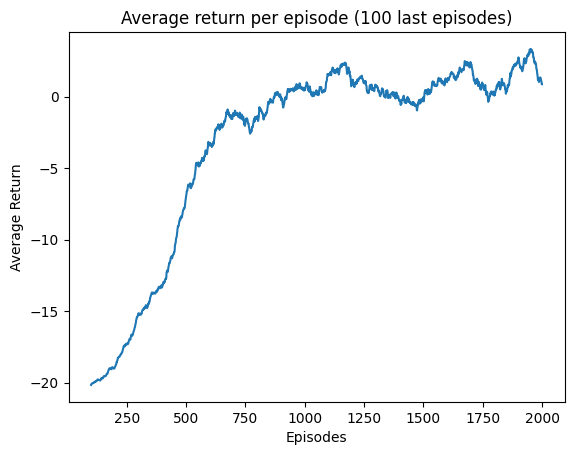
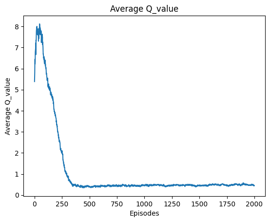

# Reinforcement Learning on simulated environments

This project aims to implement and compare various **Reinforcement Learning (RL)** algorithms to solve different simulated Gymnasium environments.  

The implementations are based on the theoretical foundations presented in the book:

> Richard S. Sutton and Andrew G. Barto, *Reinforcement Learning: An Introduction*, 2nd Edition, MIT Press, 2018.  
> [http://incompleteideas.net/book/the-book-2nd.html](http://incompleteideas.net/book/the-book-2nd.html)

 

## Pong Reinforcement Learning Agent

This project implements a Deep Q-Learning (DQN) agent to play **Atari Pong** using the OpenAI Gym environment (`ALE/Pong-v5`).  

The agent is trained with handcrafted features extracted from frames (ball position and velocity, paddles  positions, player velocity).  
Given the simplicity of the game, this approach is indeed very convenient as it allows the agent to access all relevant information from the raw frames while working with a much smaller and more manageable state space.

The sparsity of the rewards makes the training quite challenging. The agent indeed only receives a non-zero reward when it scores a point (+1) or when the opponent scores (-1). Naturally, such events occur only in a very small fraction of the timesteps experienced by the agent.

This project was originally inspired by the following paper :

> Volodymyr Mnih, Koray Kavukcuoglu, David Silver, Alex Graves, Ioannis Antonoglou, Daan Wierstra, and Martin Riedmiller,  
> *Playing Atari with Deep Reinforcement Learning*, arXiv preprint arXiv:1312.5602, 2013.  
> [https://arxiv.org/abs/1312.5602](https://arxiv.org/abs/1312.5602)

---
### 🎮 Demo

---

### 📌 Features

- Deep Q-Network (DQN) implementation in PyTorch
- Replay Buffer for experience replay (size = 50,000 )
- Target network for stable learning (update every 1,000 steps)
- Epsilon-greedy exploration strategy (ε from 1.0 → 0.05)
- Optimizer: Adam, learning rate = 1e-4
- Handcrafted state representation (paddle positions + player velocity + ball position and velocities)

---

### 📊 Results

**1. Training reward**

This plot shows the evolution of the average reward per episode during training.  
We can see that the average reward obtained while training increased a lot in the first 1000 episodes, and then increased very slowly, stabilizing to small positive values.  
However, this doesn't mean that the agent stopped learning during the second half of training. Indeed, the low return values are not caused by bad performance from the agent, but instead by :

- The $\epsilon$-greedy policy used as the behaviour policy with a minimum value for $\epsilon$ of 0.1, leading to suboptimal actions 10% of the time.

- The timestep limit set to 10000 per episode, leading to truncated episodes and consequently truncated return

**2. Average Estimated Q_values**

This plot shows the evolution of the average estimates Q_values $\hat{Q}(s,a)$ on a given set of states during training. ($y = \frac{1}{N_{states}} \sum_{s \in S} {\frac{1}{n_a}} \sum_{a \in A}{\hat{Q}(s,a)}$)

The state set used to compute this estimation has been sampled from $100$ independent episodes run with random policy. 

This plot shows the gradual improvement of the agent, both in estimating the state-action value function $Q_{\pi}(s,a)$ and improving the target policy $\pi$.
After initially overestimating the state-action values, the average estimation reduces to a more reasonable value (around 0.5) considering the scale of the values. Then, the esimation slowly increases as the behaviour policy approaches the optimal policy $\pi_*$